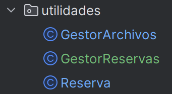

# Operaciones Básicas con Archivos en Java

Este proyecto es una práctica para aprender cómo trabajar con archivos de texto en Java. Lo hemos hecho para la asignatura, y aquí se gestionan reservas de vuelos usando archivos, clases y paquetes. Toda la lógica está hecha con Java 25 y la estructura intenta ser clara y ordenada.

## Cómo funciona

- **Creación de archivos**: Si el archivo no existe, el programa lo crea automáticamente. También se asegura de que los encabezados estén correctos.
- **Lectura y escritura**: Se guardan y leen reservas en archivos `.txt`. Los datos siempre siguen el mismo formato para que sea sencillo de entender.
- **Resumenes**: El programa puede mostrar cuántas reservas hay en total, cuántas hay por clase (por ejemplo, Business) y cuántas hay por destino.
- **Gestión de errores**: En el tercer ejercicio, si una línea no tiene todos los datos obligatorios, esa reserva no se guarda y en su lugar se apunta en un archivo de errores junto con la hora del fallo.

## Estructura del proyecto

A continuación puedes ver cómo está organizado el proyecto y sus carpetas principales:

El código está en la carpeta `src` y se divide en varios paquetes:

- **Ejercicio1**:
- Este programa crea el archivo `reservas.txt` si no existe y añade algunas reservas de ejemplo usando `GestorArchivos.escribirArchivo()
  
- Primero se comprueban los encabezados con `GestorArchivos.comprobarEncabezados()`. 
- Luego se leen las reservas del archivo con `GestorArchivos.leeryCrearInstanciasDesdeArchivo()` y se crean objetos `Reservas`. 
- Finalmente, se muestran todas las reservas en consola, se imprime el total con `Reservas.getTotalReservas()` y se cuenta cuántas son de clase Business con `Reservas.getCantidadReservasClase("Business")`.
  
****
- **Ejercicio2**: Este ejercicio amplía el anterior incluyendo el **destino** de cada reserva. 
    
- Primero se crea el archivo maestro `reservas_maestro.txt` y se añaden todas las reservas usando `GestorArchivos.escribirArchivo()`. 
- Luego se leen las reservas con `GestorArchivos.leeryCrearInstanciasDesdeArchivo()` para generar objetos `Reservas`. 
- Después, el programa crea archivos separados para cada destino y escribe en ellos las reservas correspondientes. Finalmente, muestra en consola el total de reservas por archivo/destino usando `Reservas.getCantidadPorDestino()`.
 
- **Ejercicio3**: En este ejercicio se manejan **reservas con posibles errores**. 
   
- Se lee un archivo maestro con líneas que pueden estar incompletas o mal formateadas usando `GestorArchivos.procesarReservasConErrores()`. 
- Las reservas válidas se crean como objetos `Reservas` y se escriben en archivos por destino, mientras que las líneas incorrectas se registran en `registro_errores.log`. 
- Al final, se puede ver en consola tanto las reservas por destino como el contenido del log de errores con `GestorArchivos.mostrarRegistroErrores()`.
  
- **utilidades**: Este paquete tiene dos clases: `GestorArchivos` (todas las funciones para crear, leer y escribir archivos, además de procesar errores) y `Reservas` (representa cada reserva como un objeto y lleva la lista de todas).
    
Las imágenes usadas en la documentación están en la carpeta `imagenes`, pero no son esenciales para ejecutar el código.
  

## Ejecución

Para probar el proyecto solo necesitas abrirlo en IntelliJ IDEA o cualquier IDE que soporte Java 25. Puedes ejecutar el `main` que quieras según el ejercicio:

- `SistemaReservas` (Ejercicio1)
- `SistemaGestionVuelo` (Ejercicio2)
- `SistemaGestionVueloConErrores` (Ejercicio3)

Después de ejecutar el programa, puedes revisar los archivos de texto generados en la carpeta `src` para ver los resultados.

## Autoras

Natalia Gámez Barea  
Carmen Casas Novas

---

